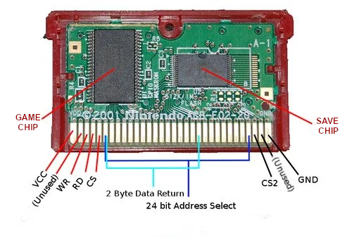

<H1>Simple GBA Cart Dumper with Arduino Nano</H1>

| **Function** | **Status** |
|:------------:|:----------:|
|  ROM DUMPING |     WIP    |
| SAVE DUMPING |     OK*    |
|  SAVE FLASH  |      -     |

*Theoretically, this project dumps the save data from original GBA Cartridges and bootlegs with dedicated chip for save data (SRAM, EEPROM and maybe FLASH). I say theoretically because I haven't tested it on original cartridges yet, I only have Chinese bootlegs that works differently. Most of these new chinese bootlegs now use a modified ROM to use a single FRAM/FLASH memory chip on the bootleg's PCB, holding both the game and the save data. This mod is called "batteryless save ROM patch". That's why the cartridge is cheaper.
So I wasn't able to dump the new chinese bootlegs with this project yet, because they need ROM dumping, but I have been able to successfully dump the save of pokemon FR in a "369 in 1" multicart cartridge (when dealing with this multicart, it's always necessary to start the game on a console before dumping). My guess is that this cartridge uses dedicated memory to save data.

Tip: For those who wants to dump the save from these "ROM patched" bootleg cartridges, I was able to dump the bootleg save using a Nintendo DS + R4 card with the GBABF tool. Just dump the entire ROM, the save data bytes will be there, you just need extract these bytes using a hex editor or with a program for that. You can also write back the save data to the bootleg. See: https://www.reddit.com/r/GameboyAdvance/comments/16mdvl7/guide_to_extracting_save_file_from/
Since not everyone has a Nintendo DS, I want to update my Arduino project to dump ROM as well, but it has a design problem... 

The problem for implementing ROM DUMPING is that the shift registers I'm using, 74hc595, are unidirectional, and together with the few ports on the Arduino Nano, it leaves me with my hands tied. The ideal option for this type of project is an Arduino Mega, which has many ports available. But I'll see what I can do.

I'll leave some ideas here so I don't forget :D
These are future changes I plan to make: ROM DUMPING

Interpreting from signal_diagrams.pdf: Reading ROM

Here the cartridge's bit bus (24 bits) is divided into 3:
- bits 0...7
- bits 8...15
- bits 16...23

Unlike the RAM reading mode, where I need to keep latching the addresses (I think this is called non-sequential access), here the access is almost 100% sequential. I only need to set the initial address 0x00 with the latch being done on the falling edge of CS. Then I just need to keep pulsing the RD and the 16 bits of data are received (the addresses are incremented internally in the chip).

I said almost sequential because, from what I understood from the pdf, the last addressing bits (16...23) will need to be latched by me, I mean, by the dumper.

To read the data, only the first 16 bits are used (0...7 + 8...16). So here I will only need 16 IO pins or change my shift registers to a bidirectional type (research about MCP23017).

Arduino nano:
- 14 Digital IO ports - 2 ports for serial = 12 IO's
- 8 Analog (but just 6 can be IO's)
Total available: 18 IO's and 2 Outputs

Perfect GBA Dumper:
- Address/Data Bus: 24 IO's
- CS, CS2, RD pins: 3 Outputs

GBA Dumper for reading ROM:
- Data Bus: 16 Inputs
- Last address byte: 8 outputs
- CS, CS2, RD pins: 3 Outputs

"GBA ROMs are special chips that contain a standard ROM, address latches, and address counters all on one chip. Cart accesses can be either sequential or non-sequential. The first access to a random cart ROM location must be non-sequential. This type of access is done by putting the lower 16 bits of the ROM address on cart lines AD0-AD15 and setting /CS low to latch address lines A0-A15. Then /RD is strobed low to read 16 bits of data from that ROM location. (Data is valid on the rising edge of /RD.) The following sequential ROM location(s) can be read by again strobing /RD low. Sequential ROM access does not require doing another /CS high-to-low transitions because there are count up registers in the cart ROM chip that keep track of the next ROM location to read. Address increment occurs on the low-to-high edge of all /RD. In theory, you can read an entire GBA ROM with just one non-sequential read (address 0) and all of the other reads as sequential so address counters must be used on most address lines to exactly emulate a GBA ROM. However, you only need to use address latch / counters on A0-A15 in order to satisfy the GBA since A16-A23 are always accurate."

References:
- https://problemkaputt.de/gbatek-gba-memory-map.htm
- https://reinerziegler.de.mirrors.gg8.se/GBA/gba.htm
- https://douevenknow.us/post/68126856498/arduino-based-gba-rom-dumper-part-1/embed
- https://github.com/shinyquagsire23/GBA-GB-ROMDumper
