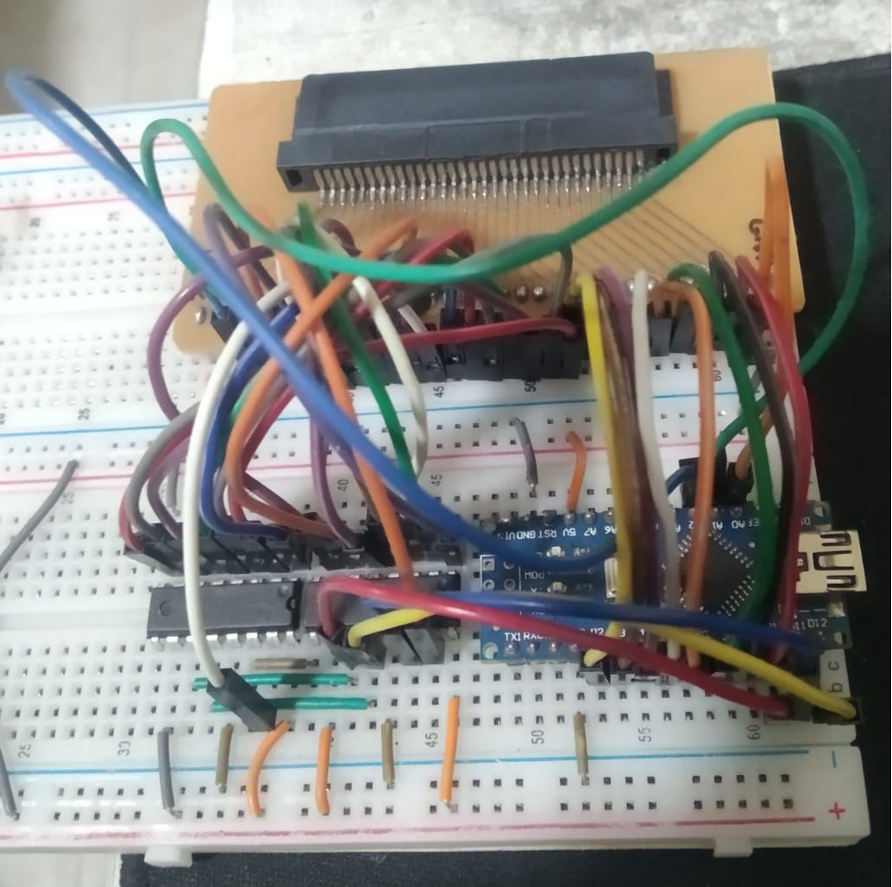

<H1>Simple GBA Cart Dumper - WIP</H1>

Theoretically, this project dumps save data from original GBA Cartridges and bootlegs with dedicated memory chip for save data (SRAM, EEPROM and maybe FLASH). I say theoretically because I haven't tested it on original cartridges yet, I only have Chinese bootlegs that works differently. Most of these new chinese bootlegs now use a modified ROM to use a single FRAM/FLASH memory chip on the bootleg's PCB, holding both the game and the save data. This mod is called "batteryless save patch". That's why the cartridge is cheaper.

So I wasn't able to dump the new chinese bootlegs with this project yet, because they need ROM dumping, but I have been able to successfully dump the "369 in 1 multicart cartridge (when dealing with this multicart, it's always necessary to start the game on a console before dumping). I believe that only this cartridge uses a different memory scheme than the other bootlegs i have.

Tip: In case someone needs to dump the save on these bootleg cartridges that use FRAM memory, I was able to dump the Pokemon Fire Red save using a Nintendo DS and making a dump of its complete ROM (it's weird, but the save bytes will be there, so you just need to use a program that extracts the save from inside the ROM). Here's a guide: https://www.reddit.com/r/GameboyAdvance/comments/16mdvl7/guide_to_extracting_save_file_from/

Since not everyone has a Nintendo DS, I want to update my Arduino project to dump ROM as well, but it has a design problem. It turns out that the shift registers I'm using, 74hc595, are unidirectional, and together with the few ports on the Arduino Nano, I'm in a tight spot. The ideal option for this type of project is an Arduino Mega, which has a lot of ports.

I'll leave some ideas here so I don't forget :D
These are future changes I plan to make: ROM DUMPING

Interpreting from signal_diagrams.pdf: Reading ROM

Here the cartridge's bit bus (24 bits) is divided into 3:
- bits 0...7
- bits 8...15
- bits 16...23

Unlike the RAM reading mode, where I need to keep latching the addresses (I think this is called non-sequential access), here the access is almost 100% sequential. I only need to set the initial address 0x00 with the latch being done on the falling edge of CS. Then I just need to keep pulsing the RD and the 16 bits of data are received (the addresses are incremented internally in the chip).

I said almost sequential because, from what I understood from the pdf, the last addressing bits (16...23) will need to be latched by me, I mean, by the dumper.

To read the data, only the first 16 bits are used (0...7 + 8...16). So here I will only need 16 IO pins or change my shift registers to a bidirectional type (research about MCP23017).

Arduino nano:
- 14 Digital IO ports - 2 ports for serial = 12 IO's
- 8 Analog (but just 6 can be IO's)
Total available: 18 IO's and 2 Outputs

Perfect GBA Dumper:
- Address/Data Bus: 24 IO's
- CS, CS2, RD pins: 3 Outputs

GBA Dumper for reading ROM:
- Data Bus: 16 Inputs
- Last address byte: 8 outputs
- CS, CS2, RD pins: 3 Outputs
